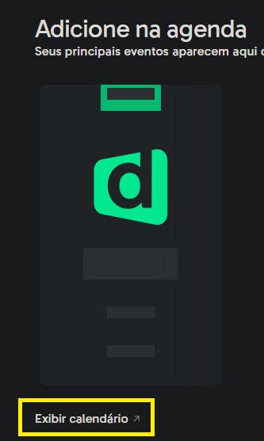
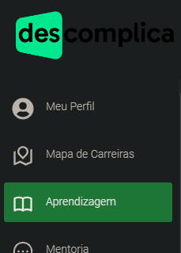
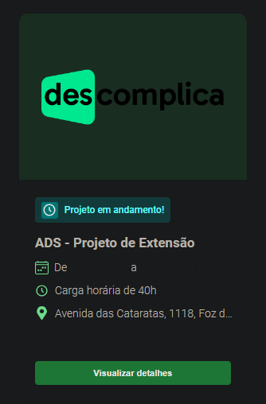
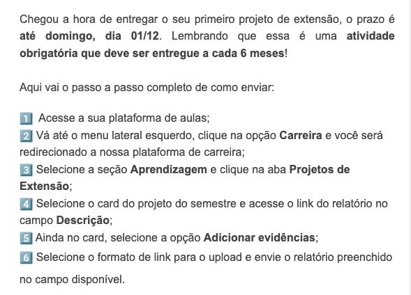
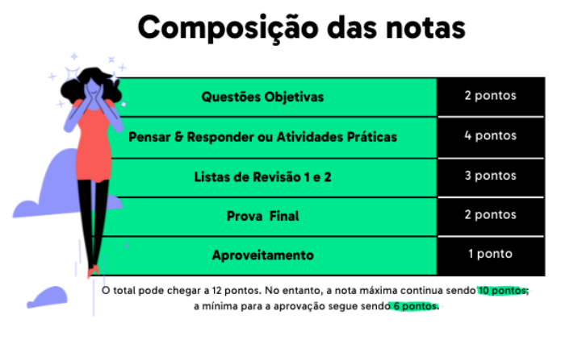
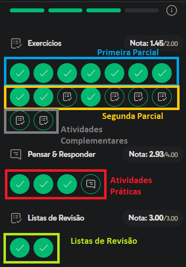
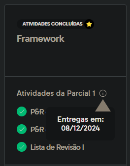
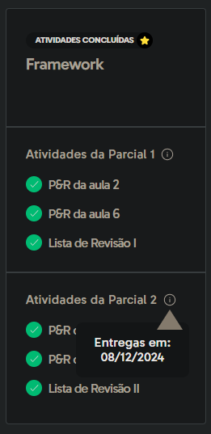
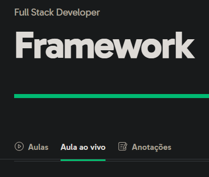

Como a faculdade não faz juz ao nome e só... **COMPLICA** 🤡

O jeito foi colocar o barquinho dos estudantes contra a correnteza!


Tabela de Conteúdo:
- [🔷 Descomplicados](#-descomplicados)
  - [🔹 Mural da PEX](#-mural-da-pex)
  - [🔹 Grupo de Whatsapp](#-grupo-de-whatsapp)
  - [🔹 Discord](#-discord)
  - [🔹 Google Drive](#-google-drive)
  - [🔹 Babysteps](#-babysteps)
  - [🔹 Cursos](#-cursos)
  - [🔹 Não tem um linkedin?](#-não-tem-um-linkedin)
  - [🔹 ABNT para trabalhos acadêmicos](#-abnt-para-trabalhos-acadêmicos)
- [🔷 ~~Des~~COMPLICA](#-descomplica)
  - [🔹 Portal do Aluno](#-portal-do-aluno)
  - [🔹 Calendário](#-calendário)
  - [🔹 Senha das Lives da Descomplica](#-senha-das-lives-da-descomplica)
  - [🔹 IA.smin](#-iasmin)
  - [🔹 Abrindo um ticket](#-abrindo-um-ticket)
  - [🔷 PEX](#-pex)
    - [🔹 Onde encontro a PEX?](#-onde-encontro-a-pex)
      - [🔹 Cartão da PEX](#-cartão-da-pex)
      - [🔹 Orientações do passo a passo](#-orientações-do-passo-a-passo)
    - [🔹 ONDE entregar a PEX?](#-onde-entregar-a-pex)
    - [🔹 COMO entregar a PEX?](#-como-entregar-a-pex)
    - [🔹 QUANDO entregar a PEX?](#-quando-entregar-a-pex)
    - [🔹 Tira-dúvidas da PEX com perguntas dos alunos](#-tira-dúvidas-da-pex-com-perguntas-dos-alunos)
    - [🔹 Perguntas Frequentes sobre Graduação e Projeto de Extensão – PEX (Descomplica)](#-perguntas-frequentes-sobre-graduação-e-projeto-de-extensão--pex-descomplica)
    - [🔹 Live sobre PEX](#-live-sobre-pex)
  - [🔹 Contato Descomplica: Desconews](#-contato-descomplica-desconews)
  - [🔹 Pontuação das Atividades](#-pontuação-das-atividades)
  - [🔹 Concluíndo as atividades com eficiência](#-concluíndo-as-atividades-com-eficiência)
  - [🔹 Parciais](#-parciais)
    - [🔹 Primeira parcial](#-primeira-parcial)
    - [🔹 Segunda parcial](#-segunda-parcial)
  - [🔹 Perdi as lives, e agora?](#-perdi-as-lives-e-agora)
  - [🔹 Gabaritos](#-gabaritos)
  - [🔷 Encontrou algum bug ou não encontrou informação específica?](#-encontrou-algum-bug-ou-não-encontrou-informação-específica)
  - [🔷 Tecnologias utilizadas no projeto](#-tecnologias-utilizadas-no-projeto)
- [🔷 Sobre o Desenvolvedor](#-sobre-o-desenvolvedor)
  - [LICENSE](#license)

# 🔷 Descomplicados

## 🔹 Mural da PEX

[+ Ir para Mural da PEX: Descomplicados](./redirect.html?site=mural_pex)

**COLABORATIVO:** Aqui todos podem deixar o print da página inicial do seu Projeto de Extensão ou das views se preferir e visualizar como ficou o trabalho dos nossos colegas!

Use o espaço à vontade!

Regra: Por favor, mude apenas o seu conteúdo 😁

## 🔹 Grupo de Whatsapp

[+ Ir para Whatsapp: Descomplicados](./redirect.html?site=grupo)

Perdido na facul? Este é o lugar certo!

Aqui temos muito assunto, muito estudo na prática e muito &lt;código/&gt;

Entre para bater-papo, tirar dúvidas e ter sucesso na sua graduação.

## 🔹 Discord

[+ Ir para Discord: Descomplicados](./redirect.html?site=discord)

Espaço para conversas por áudio, estudos e compartilhamento de tela.

Use as salas disponíveis e caso necessite de mais, contate o administrador.

## 🔹 Google Drive

[+ Ir para Google Drive: Descomplicados](./redirect.html?site=drive)

- Documentos gerados no grupo
- Dicas de cursos
- Arquivos
- Materiais de apoio
- Conversas com o ChatGPT

Explore se estiver procurando conteúdo e informação!

## 🔹 Babysteps

[+ Ir para Babysteps](./redirect.html?site=babysteps)

Muito conteúdo sobre Programação e sequencia de dicas úteis para você se tornar um bom programador, mergulhe nesse conhecimento!
- Dicas de como fazer 
- O que fazer
- Por onde começar
- Qual caminho seria bom de você seguir

> Lembre-se:
> 
> Um Dev Sênior já foi um Júnior um dia...

## 🔹 Cursos

[+ Ir para Cursos](./redirect.html?site=cursos)

Cursos gratuitos pelo YouTube e links de canais* do Telegram que são compartilhados publicamente.

***Não são de minha autoria**

## 🔹 Não tem um linkedin?

[+ Ir para Linkedin para Estudantes](./redirect.html?site=linkedin_estudantes)

Aqui estão dicas valiosas para você montar o seu perfil do Linkedin, lembre-se: Um perfil campeão é a chave para o seu sucesso profissional, especialize-se, invista em você mesmo e principalmente, saiba se apresentar!

O mundo é movido a vendas, então saiba vender seu peixe 🎣

## 🔹 ABNT para trabalhos acadêmicos

[+ Ir para ABNT para trabalhos acadêmicos](./redirect.html?site=abnt)

Se você deseja fazer trabalhos acadêmicos, existe uma série de padronizações que você deve seguir, são as **NBRs** (Normas Brasileiras de Referência) da **ABNT** (Associação Brasileira de Normas Técnicas).

No link acima, você encontra todas as modificações necessárias (algumas obritarórias) para que você produza um trabalho acadêmico de qualidade, seguindo esses padrões você pode ficar despreocupado de pensar se está fazendo do jeito certo ou não.

Escolhi esse modelo da UFRA (fonte: Google) pois está muito bem elaborado e explicado, com exemplos excelentes e o mais importante: Aborda o tema `Plágio Acadêmico`, ao qual devemos ter atenção.

**Observação importante:** A ABNT sofre alterações, por isso se vocé estiver fazendo um trabalho acadêmico, sempre procure o manual atualizado. O oficial é **pago**, mas temos algumas instituições que o disponibilizam de forma gratuita para alunos, como a UFRA, para nossa sorte, o arquivo foi disponibilizado ao público.

> Lembre-se que um trabalho sempre deve ter Início, Meio e Fim mesmo que não siga as normas ABNT

# 🔷 ~~Des~~COMPLICA

## 🔹 Portal do Aluno

[+ Ir para Portal do Aluno](./redirect.html?site=portal_do_aluno)

Página inicial do seu curso, aqui é a central de tudo o que você precisa: Central de ajuda, Calendário, Fórum, Secretaria, Lives, Disciplinas, etc.

## 🔹 Calendário

Localizado na tela inicial do [Portal do Aluno](#-portal-do-aluno), logo abaixo da programação dos eventos do seu curso.



*Fonte: [Portal do Aluno](#-portal-do-aluno) Descomplica*

## 🔹 Senha das Lives da Descomplica

`aluno`


*Fonte: [Portal do Aluno](#-portal-do-aluno) Descomplica*

## 🔹 IA.smin

A secretária virtual, IA.smin agora está localizada na `Central de Ajuda`, você pode encontrar esta opção clicando no ícone do seu perfil na página inicial do [Portal do Aluno](#-portal-do-aluno):


*Fonte: [Portal do Aluno](#-portal-do-aluno) Descomplica*

(Inclusive, aqui fica a `Central de Tickets` também)

Lá você encontrará esta linda e simpática robôzinha:


*Fonte: Central de Ajuda Descomplica*

Com ela você consegue vários tipos de ajuda, inclusive acessos às plataformas que a faculdade disponibiliza, e-mail institucional, abertura de **tickets** e etc.

## 🔹 Abrindo um ticket

Um ticket é a protocolação de uma dúvida ou problema que você abre junto da faculdade.

Agora que você localizou a IA.smin, inicie a conversa com ela, confirme seus dados, sem seguida clique em `Estudos > Orient. Profissional > Falar com a Coord` como na imagem abaixo:


*Fonte: Chat com a IA.smin, na Central de Ajuda Descomplica*

Logo em seguida ela pedirá para deixar uma mensagem explicando o que está acontecendo, digite e siga os próximos passos para gerar seu ticket.

Quando for concluído, os tickets aparecerão no mesmo menu do seu perfil, na página inicial do [Portal do Aluno](#-portal-do-aluno). ([veja o tópico acima](#-iasmin))

Caso sua demanda seja **urgente**, tenho outra solução, mas peço para que entre em contato comigo no [Grupo do whatsapp: Descomplicados](#-grupo-de-whatsapp).

## 🔷 PEX

PEX é a abreviatura para Projeto de Extensão.

É um projeto de caráter **OBRIGATÓRIO** que você desenvolve junto a uma empresa para se envolver com problemas reais da comunidade em que você está inserido, aplicando o que você aprendeu na faculdade.

A cada semestre é **obrigatório** a entrega de uma PEX.

### 🔹 Onde encontro a PEX?

Logo na página inicial do [Portal do Aluno](#-portal-do-aluno), no menu lateral esquerdo, você encontra a opção `Carreira`
> Para prosseguir, você precisa ter o acesso a Central de Carreiras, desbloqueie com a IA.smin na sessão Plataforma e Acessos!


*Fonte: [Portal do Aluno](#-portal-do-aluno) Descomplica*

Você será redirecionado para a plataforma `Workalove`, além de cursos livres, lá você também tem auxilio para encontrar vagas de emprego, estágio e etc.

Logo ao acessar, você verá este menu lateral:



*Fonte: Plataforma Workalove da Descomplica*

#### 🔹 Cartão da PEX

Clicando em `Aprendizagem` você encontrará a aba `Projeto de Extensão` e lá consta os projetos em que você está inscrito, incluindo a data de entrega, terá um `Cartão da PEX` como na imagem abaixo:



*Fonte: Plataforma Workalove da Descomplica*

#### 🔹 Orientações do passo a passo

Ao clicar em `Visualizar Detalhes` você terá muitas informações, inclusive as `Orientações do passo a passo` que estarão ao final da página, caso estes arquivos não sejam suficientes para esclarecer todas suas dúvidas, veja o tópico a seguir:

### 🔹 ONDE entregar a PEX?

**Leia o tópico:** [Onde encontro a PEX?](#-onde-encontro-a-pex)

Após ter acessado as `[Orientações do passo a passo](#-orientações-do-passo-a-passo)`, role até o final da página, o último link da seção `Preencher o Formulário online`, será onde você pode enviar a PEX.

**Mas fique atento!** Você só poderá mandar uma vez!



*Fonte: Mensagem Descomplica*

> Agredecimento ao membro: Nayza

### 🔹 COMO entregar a PEX?

**Leia o tópico:** [Onde encontro a PEX?](#-onde-encontro-a-pex)

Siga as instruções disponíveis no material da sua PEX, algumas informações podem mudar, portanto é sempre bom se orientar por lá.

Alguns alunos optaram por zipar todos os documentos que você precisará reunir, pois o [formulário de envio](#-onde-entregar-a-pex) só aceita o envio de um único arquivo.

> Agradecimento ao membro do grupo: Victor Castilho [@VictorCarrilhoDev](https://github.com/VictorCarrilhoDev)

Outra ideia também foi a de inserir todo conteúdo em um único documento PDF

> Agradecimento ao membro do grupo: João Victor

### 🔹 QUANDO entregar a PEX?

**Leia o tópico:** [Onde encontro a PEX?](#-onde-encontro-a-pex)

A data de entrega dependerá de cada aluno, é possível visualizar o prazo de entrega no [Cartão da PEX](#-cartão-da-pex).

### 🔹 Tira-dúvidas da PEX com perguntas dos alunos

[+ Ir para Retorno das dúvidas sobre PEX](./redirect.html?site=tira_duvidas_pex)

Este link é oficial da faculdade Descomplica para retorno das dúvidas que são enviadas pelos alunos através do formulário disponível em meio aos links em [Orientações do passo a passo](#-orientações-do-passo-a-passo).

> Agradecimento ao membro do grupo: Guilherme

### 🔹 Perguntas Frequentes sobre Graduação e Projeto de Extensão – PEX (Descomplica)

[+ Ir para Perguntas Frequentes – Descomplica](./redirect.html?site=descomplica_faq)

Tire boa parte de suas dúvidas aqui em relação a faculdade e principalmente: PEX, aqui também tem o [Manual do PEX](./redirect.html?site=descomplica_pex) onde você pode conhecer tudo o que precisa saber sobre o assunto, descomplique-se já!

_Fonte: <https://no.descomplica.com.br>_

### 🔹 Live sobre PEX

[+ Ir para a Live do Projeto de Extensão](./redirect.html?site=live_pex)

Nessa live foram abordados assuntos sobre os principais objetivos de se fazer a PEX, regras, ideias e outros tópicos interessantes:

> Agradecimento ao membro do grupo: [Ju @juufavarin](https://github.com/juufavarin)

## 🔹 Contato Descomplica: Desconews

[+ Abrir a conversa no Whatsapp](./redirect.html?site=desconews)

Se de todas as opções acima, não conseguir resolver seus problemas, entre em contato com este número, se o assunto não for com este departamento, eles redirecionam você para o correto:

```
Desconews (21)99792-7656

~Descomplica Graduação

Av. Barão de Tefé, 27, Sala 602 - Rio de Janeiro/RJ, CEP 20220-460
```

> Agradecimento ao membro do grupo: Taíssa

## 🔹 Pontuação das Atividades



*Fonte: [Calendário](#-calendário) do [Portal do Aluno](#-portal-do-aluno) Descomplica*

A pontuação é dividida da seguinte forma: 
- Os 7 primeiros exercícios são da [primeira parcial](#-primeira-parcial) (1 ponto)
- Próximos 7 exercícios são da [segunda parcial](#-segunda-parcial) (1 ponto)
- Últimos dois exercícios são complementares (não valem nota)
- `Atividades Práticas`/`Pensar & Responder` (4 pontos)
- `Listas de revisão` 1 e 2 (3 pontos)
- `Prova Final` (2 pontos)
- `Aproveitamento` (1 ponto)

Você pode alcançar um total de 12 pontos mas serão considerados no **máximo 10 pontos**.

Obs.: A média é de **6 pontos** para ser aprovado em cada disciplina.



*Fonte: Disciplinas do Aluno Descomplica*

## 🔹 Concluíndo as atividades com eficiência

1. Logo de cara, faça as duas `Listas de Revisão`, isso já te garante metade da média! (3 pontos)
2. Faça os exercícios da [primeira parcial](#-primeira-parcial) (os 7 primeiros)
3. Faça as `Atividades Práticas`/`Pensar & Responder` da [primeira parcial](#-primeira-parcial) (2 pontos)
4. Faça os exercícios da [segunda parcial](#-segunda-parcial) (os 7 subsequentes)
5. Faça as `Atividades Práticas`/`Pensar & Responder` da [segunda parcial](#-segunda-parcial) (2 pontos)
6. Caso não atingir a pontuação para aprovação, faça a `Prova Final`

Observações:
- A nota do aproveitamento será aplicada **automaticamente** conforme a complitude das tarefas.
- Ao atingir 75% de complitude da disciplina, você poderá reivindicar o `mini-certificado` correspondente a ela.
- Se tiver atingido a média, **não é necessário fazer a prova**! (Eu mesmo opto por fazer para testar meus conhecimentos e identificar pontos a melhorar)

## 🔹 Parciais

As parciais são prazos para entrega de atividades, localizadas na [Portal do Aluno](#-portal-do-aluno), em `Ínicio`, logo ao final da página.

Cada `trimestre` tem duas parciais:

### 🔹 Primeira parcial



*Fonte: [Portal do Aluno](#-portal-do-aluno) Descomplica*

### 🔹 Segunda parcial



*Fonte: [Portal do Aluno](#-portal-do-aluno) Descomplica*

## 🔹 Perdi as lives, e agora?

As lives ficam salvas em suas respectivas disciplinas, basta clicar na opção `Disciplinas` no menu lateral esquerdo:


Escolha a disciplina desejada e acesse a aba `Aula ao vivo`:



As reprises estarão bem aqui!

## 🔹 Gabaritos

⚠️ Nenhum gabarito é de minha autoria.

⚠️ Use em caso de extrema **necessidade**!

Tenha em mente que você **não vai aprender nada** se copiar, o ideal é aprender e praticar…

- [Google Drive](./redirect.html?site=gabarito_drive)

- [ADS - Descomplica](./redirect.html?site=gabarito_discord1)

- [ADS 2023](./redirect.html?site=gabarito_discord2)

- [ADS 2023.4](./redirect.html?site=gabarito_discord3)
  
## 🔷 Encontrou algum bug ou não encontrou informação específica?

Por favor, entre em contato comigo no [Grupo do Whatsapp: Descomplicados](#-grupo-de-whatsapp)

_Obs.: Não trabalho para a Descomplica! O grupo foi desenvolvido para ajudar os alunos_

## 🔷 Tecnologias utilizadas no projeto

Github Pages - Git - Jekyll - Markdown - GIMP - Microsoft Paint - VS Code - HTML - Javascript - Codeium

# 🔷 Sobre o Desenvolvedor

[+ Ir para Meu Site](./redirect.html?site=renj)

Me chamam de **void Beto( );** 👨‍💻

Gosto muito de ajudar a galera a se desenvolver e tenho um prazer pessoal nisso, passo uma boa parte do meu tempo criando conteúdos para quem realmente quer aprender e claro, a cada dia eu também aprendo mais!

Feito de aluno para aluno 💙

## LICENSE

Copyright &copy; 2024 Roberto Nóbrega Jr. ([@devrenj](./redirect.html?site=github)) under MIT License
