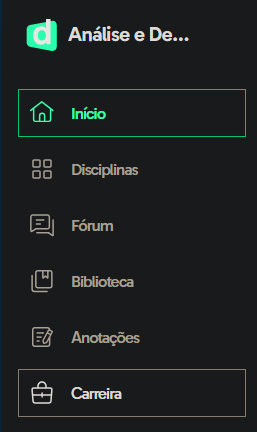
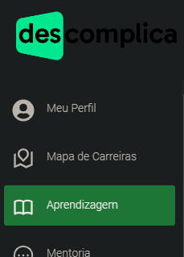

Grupo de desenvolvimento da faculdade de ADS, feito de aluno para aluno

Como a faculdade não faz juz ao nome e só...

 **COMPLICA** 🤡

O jeito foi colocar o barquinho dos estudantes contra a correnteza!

## 🔹 Grupo de Whatsapp

[+ Ir para Whatsapp: Descomplicados](./redirect.html?site=grupo)

Perdido na facul? Este é o lugar certo!

Aqui temos muito assunto, muito estudo na prática e muito &lt;código/&gt;

Entre para bater-papo, tirar dúvidas e ter sucesso na sua graduação.

## 🔹 Discord

Espaço para conversas por áudio, estudos e compartilhamento de tela.

Use as salas disponíveis e caso necessite de mais, contate o administrador.

[+ Ir para Discord: Descomplicados](./redirect.html?site=discord)

## 🔹 Senha das Lives da Descomplica

`aluno`

_Fonte:_

## 🔹 Google Drive

[+ Ir para Google Drive: Descomplicados](./redirect.html?site=drive)

- Documentos gerados no grupo
- Dicas de cursos
- Arquivos
- Materiais de apoio
- Conversas com o ChatGPT

Explore se estiver procurando conteúdo e informação!

## 🔹 Babysteps

[+ Ir para Babysteps](./redirect.html?site=babysteps)

Muito conteúdo sobre Programação e sequencia de dicas úteis para você se tornar um bom programador, mergulhe nesse conhecimento!
- Dicas de como fazer 
- O que fazer
- Por onde começar
- Qual caminho seria bom de você seguir

> Lembre-se:
> 
> Um Dev Sênior já foi um Júnior um dia...

## 🔹 Cursos

[+ Ir para Cursos](./redirect.html?site=cursos)

Cursos gratuitos pelo YouTube e links de canais* do Telegram que são compartilhados publicamente

***Não são de minha autoria**

## 🔹 Perguntas Frequentes sobre Graduação e Projeto de Extensão – PEX (Descomplica)

[+ Ir para Perguntas Frequentes – Descomplica](./redirect.html?site=descomplica_faq)

Tire boa parte de suas dúvidas aqui em relação a faculdade e principalmente: PEX, aqui também tem o [Manual do PEX](./redirect.html?site=descomplica_pex) onde você pode conhecer tudo o que precisa saber sobre o assunto, descomplique-se já!

_Fonte: <https://no.descomplica.com.br>_

## 🔹 Onde encontro a PEX?

Logo na página inicial do portal do aluno, no menu lateral esquerdo, você encontra a opção `Carreira`
> [!WARNING] Para prosseguir, você precisa ter o acesso a Central de Carreiras, desbloqueie com a IA.smin na sessão Plataforma e Acessos!

_Fonte: Portal do Aluno Descomplica_

Você será redirecionado para a plataforma `Workalove`, além de cursos livres, lá você também tem auxilio para encontrar vagas de emprego, estágio e etc.

Logo ao acessar, você verá este menu lateral:

_Fonte: Plataforma Workalove da Descomplica_

Clicando em `Aprendizagem` você encontrará a aba `Projeto de Extensão` e lá consta os projetos em que você está inscrito, incluindo a data de entrega.

Ao clicar em `Visualizar Detalhes` você terá muitas informações, inclusive as `Orientações do passo a passo` que estarão ao final da página, caso estes arquivos não sejam suficientes para esclarecer todas suas dúvidas, veja o tópico a seguir:

## 🔹 Tira-dúvidas da PEX com perguntas dos alunos

Este é o site oficial da faculdade para as dúvidas que são enviadas pelo formulário dispinível em meio aos links em `Orientações do passo a passo` dentro dos detalhes da PEX:

<https://bit.ly/resp-duvidas-PEX>

> Agradecimento ao membro do grupo: Guilherme

## 🔹 Live sobre PEX

Nessa live foram abordados assuntos sobre os principais objetivos de se fazer a PEX, regras, ideias e outros tópicos interessantes:

<https://livestream.com/accounts/8954674/events/11194068/player>

> Agradecimento ao membro do grupo: Ju

## 🔹 IA.smin e Tickets

A secretária virtual, IA.smin agora está localizada na `Central de Ajuda`, você pode encontrar esta opção clicando no ícone do seu perfil na página inicial do portal do aluno:

_Fonte: Portal do Aluno Descomplica_

(Inclusive, aqui fica a `Central de Tickets` também)

Lá você encontrará esta linda e simpática robôzinha:

_Fonte: Central de Ajuda Descomplica_

Com ela você consegue vários tipos de ajuda, inclusive acessos às plataformas que a faculdade disponibiliza, e-mail institucional, abertura de **tickets** e etc.

## 🔹 Abrindo um ticket

Agora que você localizou a IA.smin, inicie a conversa com ela, confirme seus dados, sem seguida clique em `Estudos > Orient. Profissional > Falar com a Coord` como na imagem abaixo:

_Fonte: Chat com IA.smin, na Central de Ajuda Descomplica_

Logo em seguida ela te pede para deixar uma mensagem explicando o que está acontecendo, explique e siga os próximos passos para gerar seu ticket.

Quando for concluído, os tickets aparecerão no mesmo menu do seu perfil, na página inicial do portal do aluno (veja o tópico acima)

Caso sua demanda seja **urgente**, tenho outra solução, mas peço para que entre em contato comigo no [grupo do whatsapp: Descomplicados](#-grupo-de-whatsapp).

## 🔹 Contato Descomplica: Desconews

Se de todas as opções acima, não conseguir resolver seus problemas, entre em contato com este número, se o assunto não for com este departamento, eles redirecionam você para o correto:

**Desconews** (21)99792-7656

[+ Link para abrir a conversa no Whatsapp](https://wa.me/5521997927656)

~Descomplica Graduação

Av. Barão de Tefé, 27, Sala 602 - Rio de Janeiro/RJ, CEP 20220-460

## 🔹 Não tem um linkedin?

[+ Ir para Linkedin para Estudantes](./redirect.html?site=linkedin_estudantes)

Aqui estão dicas valiosas para você montar o seu perfil do Linkedin, lembre-se: Um perfil campeão é a chave para o seu sucesso profissional, especialize-se, invista em você mesmo e principalmente, saiba se apresentar!

O mundo é movido a vendas, então saiba vender seu peixe 🎣

## 🔹 Gabaritos

⚠️ Nenhum gabarito é de minha autoria.

⚠️ Use em caso de extrema **necessidade**!

Tenha em mente que você **não vai aprender nada** se copiar, o ideal é aprender e praticar…

- <https://docs.google.com/spreadsheets/d/1qso-vckMjekNxqr0nEUBhA9dytBuqo2f4X8kM6wqTIE/edit#gid=1119658359>
  
- <https://discord.gg/jvjzcXjtdG>

- <https://discord.gg/RtSBvm3HQ3>

- <https://discord.gg/6DbP5vx5mt>

## 🔹 Desenvolvedor

Me chamam de **void Beto( );** 👨‍💻

Gosto muito de ajudar a galera a se desenvolver e tenho um prazer pessoal nisso, passo uma boa parte do meu tempo criando conteúdos para quem realmente quer aprender e claro, a cada dia eu também aprendo mais!

Feito de aluno para aluno 💚

[+ Ir para Meu Site](./redirect.html?site=renj)

## LICENSE

Copyright (c) 2024 Roberto Nóbrega Jr. ([@devrenj](./redirect.html?site=github)) under MIT License
